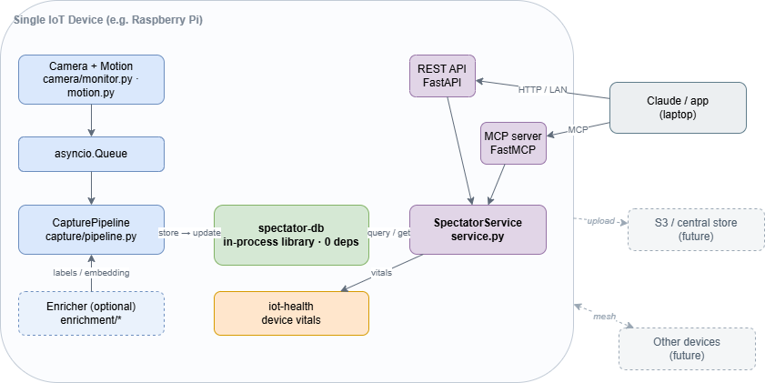

# IoT Spectator

Capture image and video on commodity IoT devices — like a Raspberry Pi — and query it by **time**, by **event**, or by **meaning**. On-device, offline-first, with optional AI enrichment.

## What's IoT Spectator

IoT Spectator turns a single low-cost device with a camera into a self-contained "intelligent recorder." A device captures media when something happens (motion, or an on-demand trigger), stores each clip or frame alongside its metadata, and lets you ask questions about what it saw later — from "show me everything between 3 and 5 PM yesterday" to "did anything with a person in it happen at the front door" to "find frames that look like this one."

**Why use it**

- **Runs on commodity hardware.** Designed for a Raspberry Pi or similar; no GPU or special accelerator required.
- **Fully autonomous per device.** Each device works with no cloud, no network, and no AI model present. AI is an optional enhancement, never a dependency.
- **Queryable, not just recorded.** Temporal, event/label, and semantic (similarity) queries — not a wall of unsearchable footage.
- **Agent-ready.** A device can expose its media to an assistant (e.g. Claude on your laptop) over the LAN via MCP, so you can ask about what your camera saw in natural language.
- **A building block, not a black box.** The storage engine (`spectator-db`) is a small, dependency-light Python library you can reuse in your own projects — it is useful on its own, independent of the rest of the system.

**How it can help**

Point a device at a driveway, a porch, a workbench, a bird feeder, a lab bench, or a plant, and let it watch. Later, find the moment you care about by when it happened, what was in it, or what it looked like — without scrubbing through hours of video, and without sending anything to a cloud service.

## Overview

IoT Spectator is built from three components that run on each device. The mental model: **`spectator-db` is the memory and brain, `spectator-data-collector` is the eyes and hands, and `iot-health` reports the device's vitals.**

- **[`spectator-db`](https://github.com/iot-spectator/spectator-db)** — a self-contained, in-process media database. It stores the media file, its structured metadata (time, device, labels, description), and its embedding behind one interface, with pluggable file/metadata backends and zero required dependencies. It only *stores* enrichment; it never generates it.
- **[`spectator-data-collector`](https://github.com/iot-spectator/spectator-data-collector)** — the on-device agent. It reads the camera, detects motion, records captures, optionally enriches them with a model, and writes them to `spectator-db`. It exposes query and control operations over both a REST API and an MCP server through one shared service layer.
- **[`iot-health`](https://github.com/iot-spectator/iot-health)** — a small library that reports device vitals (platform, CPU, memory, disk, temperature, cameras), with automatic Raspberry Pi vs. generic-Linux detection.

Devices are independent and never depend on a central database. Sharing data to a central store (e.g. S3) and device-to-device coordination (a mesh) are possible future additions and live in the collector, never in `spectator-db`.

For the full design, requirements, and the architectural decisions behind this, see [`docs/design.md`](docs/design.md).

## How to Use It

_Documentation coming soon._
